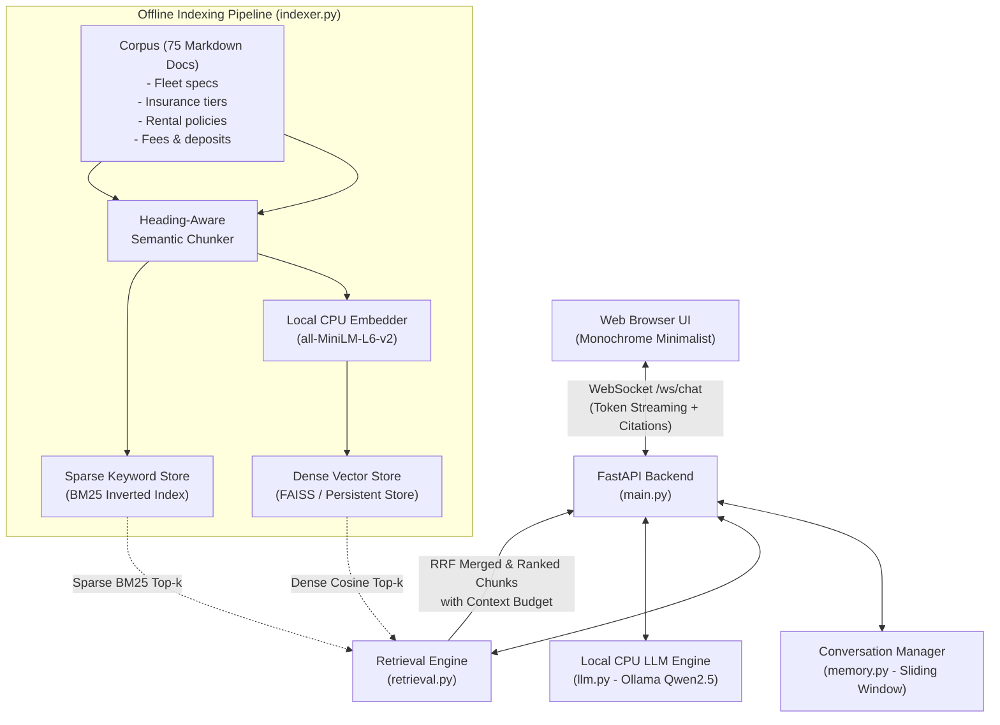

# Getting Started Guide: NLP Assignment 2 — RAG Car Rental Assistant (Apex Drive)

Welcome to **Assignment 2**! In this assignment, we are taking the **Apex Car Rental Assistant** from Assignment 1 and giving it domain retrieval capabilities using **Retrieval-Augmented Generation (RAG)**.

---

## 1. What Has Changed from Assignment 1?

| Aspect | Assignment 1 (Prompt Orchestration) | Assignment 2 (RAG-Powered) |
|---|---|---|
| **Knowledge Base** | Hardcoded in `SYSTEM_PROMPT` in `prompts.py` | 50–100 realistic domain documents indexed in a vector store |
| **Grounding** | LLM memory & prompt instructions only | Dynamic retrieval of top-$k$ relevant passages per user query |
| **New Component** | None | **Retrieval Module** (Embedding Engine + Vector Store + Hybrid Search) |
| **API Contract** | WebSocket (`/ws/chat`), streaming tokens | **Preserved 100%**, plus citation metadata payload |
| **Bonus Features** | N/A | **Hybrid Search (BM25 + Dense Vector)** + **Visible UI Citations** |

---

## 2. System Architecture



---

## 3. The 4 Phases & Assignment Breakdown

### Phase I — Indexing Pipeline
- **Corpus**: 75 curated, realistic documents in `data/documents/` covering:
  - 15 Fleet vehicle models with specs, luggage capacity, MPG, and daily rates.
  - 10 Insurance and damage policies (CDW, SLI, Silver, Gold Platinum, deductible terms).
  - 10 Pricing, surcharge, and deposit rules (young drivers, debit holds, toll fees).
  - 10 Eligibility, license, international permits, and cancellation policies.
  - 10 Pickup, inspection, return, fuel, and EV battery charging rules.
  - 10 Emergency procedures (breakdown, flat tire, police report, lost keys).
  - 10 Airport & downtown location operating guides.
- **Chunking Strategy**: Markdown heading-aware chunker (~250–350 tokens per chunk with 40-token overlap) preserving document metadata (`doc_id`, `title`, `category`, `filename`).
- **Embedding Model**: `all-MiniLM-L6-v2` via `sentence-transformers` (384 dimensions, runs in ~15ms on CPU).
- **Vector Store**: CPU vector store with persistent storage and incremental hash tracking (`doc_hashes.json`) for re-runnable updates without re-indexing unchanged documents.

### Phase II — Retrieval Integration
- For every incoming user message:
  1. Check query cache (LRU).
  2. Embed query and search Dense Vector Store (top-k).
  3. Query Sparse BM25 index (top-k).
  4. Fuse results using **Reciprocal Rank Fusion (RRF)**:
     $$\text{RRF Score}(d) = \sum_{m \in \{dense, sparse\}} \frac{1}{60 + \text{rank}_m(d)}$$
  5. Apply **Context Budget Management**: Enforce a strict token ceiling (e.g., 1,200 tokens max for retrieved context) to guarantee the model's context window is never exceeded.
  6. Inject retrieved chunks into `prompts.py` with citation tags (`[Doc: <title>]`).

### Phase III — Keeping It Real-Time
- **Retrieval Latency**: Kept strictly under 100ms (far below the assignment's 1.0s ceiling).
- **Asynchronous Execution**: Embedding and search executed in thread pool (`asyncio.to_thread`) so the FastAPI event loop is never blocked.
- **Query Caching**: LRU memory cache for query embeddings and top-k results.
- **Streaming**: WebSocket token streaming continues seamlessly with TTFT and TPS metrics.
- **Benchmark Suite**: Standalone `benchmark.py` testing 50 realistic queries, reporting min, mean, p50, p95, and p99 latencies.

### Phase IV — Failure Handling & Graceful Degradation
- **Low Relevance Fallback**: If max similarity score is below the confidence threshold ($\sim 0.32$), the assistant informs the user it doesn't have specific documents on that query and answers in general domain terms without fabricating fake facts.
- **Component Timeout / Failure**: If retrieval fails or times out, the system catches the exception and falls back to base conversation memory without hanging or crashing the WebSocket.
- **Context Overflow Protection**: Explicit token trimming ensures total prompt length stays well within model limits.

### Bonus Features Included
1. **Hybrid Search (BM25 + Vector RRF)**: Captures exact terms (e.g., "Ford Explorer", "SLI", "$45", "CDW") and conceptual semantics ("can my 22-year-old sister drive").
2. **Visible Interactive Citations in Web UI**: The frontend displays clickable citation chips showing source documents and matched excerpts.

---

## 4. What You Need to Run the Project

1. **Python 3.10+** (Detected: `Python 3.12.9`)
2. **Ollama**:
   - Ensure Ollama is running: `ollama serve`
   - Model: `ollama pull qwen2.5:1.5b` (or `qwen2.5:0.5b` / `llama3.2:1b`)
3. **Dependencies**:
   - `fastapi`, `uvicorn[standard]`, `websockets`, `httpx`, `pydantic`
   - `sentence-transformers`, `torch`
   - `rank-bm25` (for hybrid search)

---

## 5. Quick Command Summary

```powershell
# 1. Setup Python Virtual Environment
python -m venv venv
.\venv\Scripts\activate

# 2. Install Dependencies
pip install -r requirements.txt

# 3. Build & Run Offline Indexing Pipeline
python indexer.py

# 4. Run Retrieval Benchmark
python benchmark.py

# 5. Start the Server
python main.py
# Open browser at: http://127.0.0.1:8080
```
