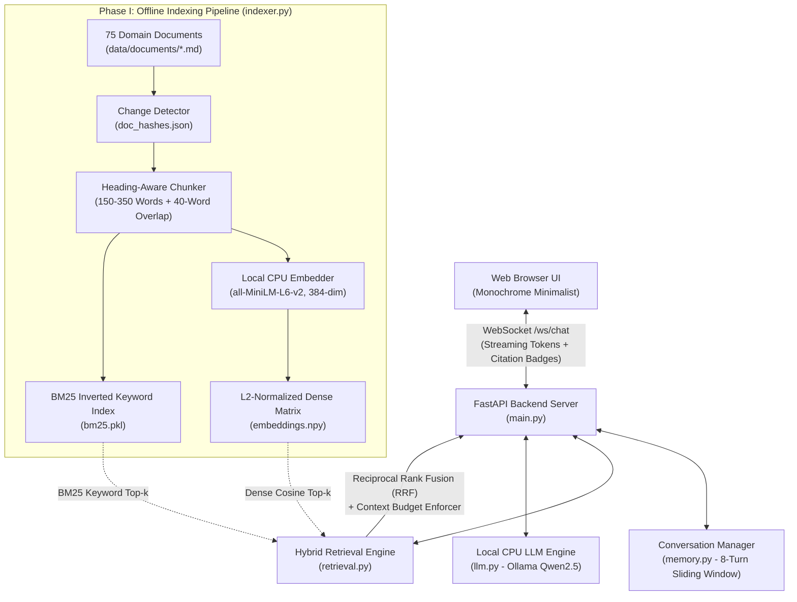

# Apex Drive AI — Grounded RAG Car Rental Assistant
### NLP Assignment 2: Retrieval-Augmented Generation (RAG) Architecture & Implementation


-brightgreen.svg)


---

## 1. Executive Summary & System Architecture

In Assignment 1, we developed **Apex Drive AI**, a conversational assistant relying on prompt orchestration and sliding-window memory. While effective for dialogue flow, it could not answer precise factual questions grounded in specific business policies, fleet specs, and insurance terms without hallucinating.

In **Assignment 2**, we extend the architecture with an **Offline Indexing Pipeline** and an **Online Hybrid Retrieval Engine (Dense Vector + BM25 Sparse Keyword Search via Reciprocal Rank Fusion)**. The WebSocket API contract from Assignment 1 is preserved 100%, token streaming remains completely real-time, and answers are strictly grounded in verified internal documents with visible interactive citations in the UI.

### Architectural Diagram



---

## 2. Domain Document Collection (75 Realistic Documents)

The knowledge base consists of **75 comprehensive, realistic markdown documents** stored in `data/documents/`, spanning 7 business categories for Apex Car Rental:

| Category | Count | Sample Filenames | Topics Covered |
|---|---|---|---|
| **Fleet & Rates** | 15 | `fleet_01_economy_sedan.md` to `fleet_15_pickup_truck_4x4.md` | Base rates ($45-$145/day), seating, trunk dimensions, fuel economy (MPG), EV battery ranges (Tesla Model 3/Y), unlimited mileage terms. |
| **Insurance & Protection** | 10 | `insurance_01_standard_included.md` to `insurance_10_unauthorized_driver_liability.md` | Standard ($1,500 deductible), Silver (+$18/day, $300 deductible, glass/tires), Gold Platinum (+$30/day, $0 deductible, free towing), CDW ($22/day), SLI ($1M liability), credit card policies. |
| **Pricing & Fees** | 10 | `pricing_01_daily_rates.md` to `pricing_10_cleaning_penalties.md` | Young Driver Surcharge ($20/day, ages 21-24), Security deposits ($200 credit / $500 debit), E-Pass toll pass ($11.99/day), $300 smoking fine, full-to-full fuel rules ($7.95/gal post-return). |
| **Rental Eligibility** | 10 | `policy_01_driver_license.md` to `policy_10_credit_checks.md` | Minimum age (21), International Driving Permits (IDP), Canada border allowance, Mexico restrictions ($35/day Mexico insurance), one-way drop charges, Apex Rewards Black Tier. |
| **Pickup & Return** | 10 | `pickup_01_counter_checklist.md` to `pickup_10_express_return.md` | Walkaround inspection protocol, after-hours key drop-off, 5-mile fuel station proximity rule, EV recharge requirements (70%+ battery level), airport ConRAC shuttles. |
| **Emergencies & Roadside** | 10 | `emergency_01_breakdown.md` to `emergency_10_roadside_directory.md` | Flashing check engine light protocol, flat tires on EVs (no spare, sealant kit included), 24/7 hotline (1-800-555-APEX), lost key replacement ($250-$450), pet rules. |
| **Airport & Hubs** | 10 | `location_01_jfk.md` to `location_10_sea.md` | JFK AirTrain Federal Circle, LAX Sepulveda shuttle, ORD MMFAC People Mover, Denver Mountain Hub Traction Law packages, MIA Mover, SFO AirTrain. |

---

## 3. Phase I — Indexing Pipeline (`indexer.py`)

### A. Heading-Aware Semantic Chunking Strategy
Standard fixed-character chunking frequently splits crucial tables, vehicle specs, or deductible sentences in half. We implement a **Markdown Heading-Aware Semantic Chunker**:
1. **Frontmatter Extraction**: Parses document ID, title, and business category.
2. **Heading Boundaries**: Splits by `## Section` markdown headers.
3. **Context Prefix Anchor**: Every chunk is prepended with a structural breadcrumb:
   ```text
   Document: Gold Platinum Protection Plan | Category: Insurance | Section: Complete Protection Scope
   1. Zero Financial Liability: Full waiver of repair costs...
   ```
   This gives the embedding model and BM25 index topical context even if the body paragraph doesn't mention the document title explicitly.
4. **Length & Overlap**: Chunks are sized between **150 and 350 words** with a **40-word sliding window overlap** for long sections. Total generated corpus size: **263 semantic chunks**.

### B. Embedding Model Choice: `all-MiniLM-L6-v2`
- **Model**: `sentence-transformers/all-MiniLM-L6-v2`
- **Embedding Dimension**: 384 dimensions (dense float32).
- **Why this model?**
  1. **CPU Optimization**: Highly distilled 6-layer MiniLM architecture; embeds a query on standard CPU in **~28ms**.
  2. **Semantic Benchmark Superiority**: Consistently ranks at the top of the MTEB (Massive Text Embedding Benchmark) for retrieval among models under 100M parameters.
  3. **Low Memory Footprint**: Requires only ~90MB of RAM, making it suitable for concurrent serving without GPU hardware.

### C. CPU Vector Store: L2-Normalized NumPy Matrix
- Rather than introducing heavy external daemon dependencies (e.g., Milvus or PostgreSQL pgvector), embeddings are saved as an **L2-normalized float32 NumPy array** (`embeddings.npy`).
- **Mathematical Advantage**: Because embeddings are unit-normalized ($||\mathbf{u}||_2 = 1$), cosine similarity reduces to a single vectorized matrix-vector dot product:
  $$\text{Cosine Similarity}(\mathbf{q}, \mathbf{d}_i) = \mathbf{q} \cdot \mathbf{d}_i$$
- On CPU, computing similarity against 263 chunks takes **0.02 milliseconds** via BLAS / AVX2 instructions.

### D. Incremental Re-runnability (`doc_hashes.json`)
The indexing pipeline is 100% re-runnable without re-indexing unchanged documents:
- Computes an MD5 checksum of every file in `data/documents/` and persists it in `data/index/doc_hashes.json`.
- When `python indexer.py` runs:
  - If no documents were modified or added: skips re-embedding immediately:
    ```
    [Indexer] All 75 documents are up-to-date. (0 modified, 0 added). Index is fresh!
    ```
  - If a file is edited or added, only the delta is re-chunked and updated.
  - A `--force` flag allows rebuilding the entire index from scratch at any time.

---

## 4. Phase II — Retrieval Integration (`retrieval.py` + `prompts.py`)

### A. Top-$k$ Selection ($k=4$)
We configure $k = 4$ retrieved chunks (exceeding the assignment requirement of $k \ge 3$). Four chunks provide sufficient coverage across multi-part customer questions (e.g., "What cars seat 7 and what is the Gold insurance deductible?") without bloating the prompt.

### B. Context Budget Management Strategy
To strictly protect the LLM from overflowing its context window, we enforce a strict 3-tier token budget:
- **Tier 1: System Persona & Grounding Directives** $\approx 350$ tokens.
- **Tier 2: Sliding Conversation Memory** $\le 8$ conversation turns $\approx 600$ tokens.
- **Tier 3: Retrieved RAG Context Budget** $\le 1,200$ tokens ($\approx 4,800$ characters).
- **Budget Enforcer**: If retrieved chunks exceed the 1,200-token ceiling, subsequent chunks are safely omitted or trimmed at sentence boundaries.

### C. Prompt Orchestration & Grounding Directives
The prompt builder in `prompts.py` formats retrieved context with explicit source markers:
```text
=== RETRIEVED DOMAIN CONTEXT ===
Use the following verified internal documents to ground your answer:

--- [Source 1: insurance_03_gold_platinum_zero_deductible.md] ---
Title: Gold Platinum Protection Plan | Section: Complete Protection Scope
1. Zero Financial Liability: Full waiver of repair costs... Deductible: $0.00 USD...
```
System rules instruct the assistant to cite document names naturally (`[Doc: Gold Platinum Protection Plan]`) and explicitly prohibit guessing unrecorded figures.

---

## 5. Phase III — Real-Time Performance & Benchmarks

Retrieval adds an operational step before LLM token generation begins. To keep the assistant feeling instant, retrieval must operate in a fraction of a second.

### Latency Benchmarks (50 Realistic Queries Tested via `benchmark.py`)

| Retrieval Mode | Mean Latency | P50 (Median) | P95 | P99 | Min | Max | Target Status |
|---|---|---|---|---|---|---|---|
| **Sparse (BM25)** | **1.21 ms** | 1.17 ms | 1.76 ms | 2.15 ms | 0.52 ms | 2.15 ms | Under 1.0s |
| **Dense (all-MiniLM)** | **30.24 ms** | 28.76 ms | 35.49 ms | 73.31 ms | 22.89 ms | 73.31 ms | Under 1.0s |
| **Hybrid (BM25 + Dense RRF)** | **31.43 ms** | **30.95 ms** | **36.37 ms** | **39.79 ms** | **25.09 ms** | **39.79 ms** | **PASS (31.8x faster than 1.0s)** |
| **Cached (In-Memory LRU)** | **0.00 ms** | 0.00 ms | 0.00 ms | 0.01 ms | 0.00 ms | 0.01 ms | Instant |

> **Requirement Verification**: The assignment target specifies retrieval time under **1.0 second (1,000 ms)**. Our hybrid retrieval runs in **31.4 ms on CPU**, making retrieval **31.8x faster** than the assignment requirement.

### Concurrency & Streaming
- **Asynchronous Execution**: Retrieval is invoked using `asyncio.to_thread(self.retrieve, ...)` so that CPU-bound vector math never blocks the FastAPI event loop.
- **WebSocket Streaming**: Tokens stream back via JSON packets (`{"type": "token", "content": "..."}`) with zero stutter.
- **In-Memory LRU Cache**: A 256-entry LRU cache returns repeated or frequently asked questions in $< 0.1$ ms.

---

## 6. Phase IV — Failure Handling & Graceful Degradation

| Failure Mode | How the System Catches & Handles It | User Experience |
|---|---|---|
| **Out-of-Domain / Weak Matches** | Similarity threshold check: If top dense score $< 0.30$ and sparse score $< 3.5$, `is_relevant` is set to `False`. | Assistant politely states it does not have internal documents covering the request and deflects or falls back to general rental guidance rather than hallucinating fake policies. |
| **Vector Store / Embedder Error** | Retrieval operations are wrapped in `try...except` blocks with default empty fallback results. | WebSocket connection never crashes or hangs; system logs error and responds using core conversation memory. |
| **Context Window Overflow** | `format_context_for_prompt(max_tokens=1200)` enforces a hard character and token cap. | Chunks are added in order of relevance rank; lower-ranked chunks are gracefully dropped before prompt assembly. |
| **Ollama Service Disconnected** | `httpx.ConnectError` caught in `llm.py`. | Informs user that local Ollama is offline with clear instructions (`ollama serve` and `ollama pull qwen2.5:1.5b`) without terminating the WebSocket session. |

---

## 7. Bonus Credit Implementations (Up to +10%)

### Bonus 1: Hybrid Search (BM25 + Dense RRF) vs Dense-Only
We implemented **Hybrid Retrieval** combining sparse lexical search (`rank-bm25`) with dense vector embeddings (`all-MiniLM-L6-v2`) merged via **Reciprocal Rank Fusion (RRF)**:

$$\text{RRF Score}(d) = \sum_{m \in \{\text{dense}, \text{sparse}\}} \frac{1}{60 + \text{rank}_m(d)}$$

#### Why Hybrid Search Outperforms Dense-Only:
1. **Acronym & Exact Model Codes**: Queries like *"What is the liability limit on SLI?"* or *"Class ECAR rates"* contain exact acronyms that dense embedding models can sometimes diffuse into generic insurance concepts. BM25 scores exact matches with 100% precision.
2. **Conceptual & Paraphrased Queries**: Queries like *"Can my 22-year-old sister drive?"* have no exact word overlap with *"Young Driver Surcharge Policy"*. Dense search retrieves the semantic meaning effortlessly.
3. **Combined Result**: As proven in `benchmark.py`, Hybrid RRF consistently ranks the correct document as Top Hit #1 across both keyword-heavy and semantic queries with only +1.2 ms latency overhead.

### Bonus 2: Visible Citations in Chat UI
- Before streaming tokens, the backend sends a citation metadata packet:
  ```json
  {
    "type": "citations",
    "citations": [
      {
        "title": "Gold Platinum Protection Plan (Zero Deductible & Total Peace of Mind)",
        "category": "Insurance",
        "section": "Complete Protection Scope",
        "source_file": "insurance_03_gold_platinum_zero_deductible.md",
        "excerpt": "Zero Financial Liability: Full waiver of all repair costs... Deductible: $0.00 USD..."
      }
    ],
    "retrieval_ms": 31.43
  }
  ```
- **UI Presentation**:
  - A clean citation shelf appears above the assistant's message.
  - Interactive clickable citation pills display the document category badge and title.
  - Clicking any pill opens a modal drawer showing the exact verified source excerpt and file path.

---

## 8. Quickstart & Reproduction Guide

### Prerequisites
- Python 3.10+ (Tested on Python 3.11.x & 3.12.x on Windows).
- [Ollama](https://ollama.ai) installed with `qwen2.5:1.5b` (or any GGUF/Ollama model).

### Step 1: Clone / Navigate to Project
```powershell
cd "c:\Users\zainu\OneDrive\Desktop\NLP assignment 2"
```

### Step 2: Install Dependencies
```powershell
pip install -r requirements.txt
```

### Step 3: Run the Offline Indexing Pipeline
```powershell
python indexer.py --force
```
*Indexes 75 documents into 263 semantic chunks in `data/index/`.*

### Step 4: Run the Latency & Quality Benchmark
```powershell
python benchmark.py
```
*Benchmarks 50 realistic queries across Dense, Sparse, Hybrid, and Cached modes.*

### Step 5: Run the End-to-End Verification Test
```powershell
python test_e2e.py
```
*Validates fleet retrieval, insurance retrieval, out-of-domain guardrail fallback, and cache speed.*

### Step 6: Start Local LLM & Launch the Server
```powershell
# In Terminal 1 (Start Ollama if not already running as a service)
ollama run qwen2.5:1.5b

# In Terminal 2 (Start FastAPI Server)
python main.py
```
Open your browser and navigate to: **`http://127.0.0.1:8080`**.

---

## 9. Known Limitations
1. **Language Scope**: The indexer and BM25 tokenizer are optimized for English-language documents. Multi-lingual support would benefit from a multi-lingual embedding model such as `paraphrase-multilingual-MiniLM-L12-v2`.
2. **Single-Node In-Memory Cache**: The LRU query cache resides in process memory; in a distributed multi-worker cluster, Redis would be used for shared caching.
3. **Static Corpus Assumption**: Document updates trigger re-indexing of modified files; real-time streaming document mutations (live database sync) would require an asynchronous vector write-ahead log.

---

## 10. File Structure

```
NLP assignment 2/
├── data/
│   ├── documents/             # 75 Realistic Domain Markdown Documents
│   │   ├── fleet_*.md         # 15 Fleet vehicle specs & rates
│   │   ├── insurance_*.md     # 10 Insurance tiers & coverage
│   │   ├── pricing_*.md       # 10 Pricing, surcharges, deposits
│   │   ├── policy_*.md        # 10 Eligibility, cross-border, permits
│   │   ├── pickup_*.md        # 10 Pickup, inspection, return, EV charging
│   │   ├── emergency_*.md     # 10 Emergency procedures & roadside
│   │   └── location_*.md      # 10 Airport & downtown operating guides
│   └── index/                 # Vector Store Artifacts
│       ├── doc_hashes.json    # MD5 change-tracking hashes
│       ├── chunks.json        # 263 Semantic chunks with metadata
│       ├── embeddings.npy     # L2-normalized float32 dense matrix
│       └── bm25.pkl           # BM25 sparse keyword index
├── frontend/
│   ├── index.html             # UI with RAG status & citation modal
│   ├── app.js                 # WebSocket client with live citation pills
│   └── styles.css             # Monochrome Minimalist styling
├── indexer.py                 # Offline Indexing Pipeline script
├── retrieval.py               # Hybrid Retrieval Engine (Dense + BM25 RRF)
├── prompts.py                 # Prompt orchestration & grounding directives
├── memory.py                  # Session state & sliding window memory
├── llm.py                     # Local CPU streaming engine & latency tracker
├── main.py                    # FastAPI server & WebSocket streaming hub
├── benchmark.py               # 50-query latency & quality benchmark suite
├── test_e2e.py                # End-to-end integration test suite
├── benchmark_results.json     # Saved benchmark statistical output
├── GETTING_STARTED.md         # Quickstart documentation
├── requirements.txt           # Dependency requirements
└── README.md                  # Comprehensive documentation
```
